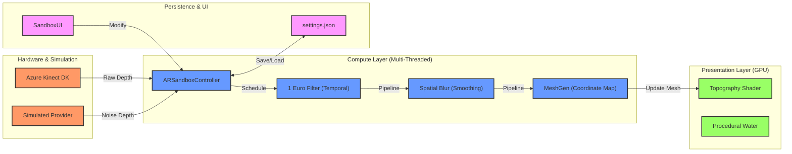

# 🏔️ Unity AR Sandbox: Technical Architecture
> A high-performance, modular system for real-time depth-to-terrain mapping.

---

## 📌 Executive Summary
This project implements a high-performance **Unity-based Augmented Reality Sandbox**. It is engineered for ultra-low latency depth processing, utilizing the **Unity Job System** and **Burst Compiler** to handle high-resolution topographic updates at 60+ FPS.

---

## 🛠️ System Architecture

---

## ⚡ Performance Profile

| Metric | Target | Solution |
| :--- | :--- | :--- |
| **Frame Rate** | 60+ FPS | Burst Compiled Jobs |
| **Grid Resolution** | 512x512 | NativeArray Pointers |
| **Latency** | < 16ms | Async Job Scheduling |
| **Visual Fidelity** | Pixel-Sharp | Triplanar Fragments |

---

## 🧠 Core Component Deep-Dive

### 1. Hardware Abstraction (Provider Pattern)
The system decouples hardware from logic via the `IDepthProvider` interface.

> [!TIP]
> **Simulated Sandbox**: You can develop without a Kinect! The `SimulatedDepthProvider` uses **Simplex Noise (Snoise)** generated in Burst to mimic sand movements and piles.

- [KinectDepthProvider.cs](file:///d:/motionsix/Sandbox%28new%29/Assets/Scripts/Providers/KinectDepthProvider.cs): High-precision sensor integration.
- [IDepthProvider.cs](file:///d:/motionsix/Sandbox%28new%29/Assets/Scripts/Interfaces/IDepthProvider.cs): The protocol for all depth sources.

---

### 2. The Compute Pipeline (Jobs + Burst)
The processing heart of the sandbox is located in `ARSandboxController.cs`.

> [!IMPORTANT]
> **Parallel Processing**: To maintain 60FPS, all math operations (Blur, Filter, Mesh Gen) are offloaded from the Main Thread to worker threads. Never perform nested loops on the main thread!

#### A. Temporal Filtering (`OneEuroJob`)
Utilizes a **1 Euro Filter** to eliminate sensor jitter.
- **Low Speed**: Heavy smoothing to stabilize the terrain when no movement is detected.
- **High Speed**: High responsiveness to follow hands/shovels accurately.

#### B. Spatial Smoothing (`SpatialBlurJob`)
Fills sensor "shadows" (data holes) and rounds off the "staircase" effect of 16-bit depth values.

#### C. Mesh Generation (`MeshGenJob`)
The final step translates depth values into vertex positions. It handles **Corner Calibration** (`pBL`, `pTL`, etc.) to ensure the virtual mesh perfectly aligns with the physical wooden box.

---

### 3. Rendering Logic (`Topography.shader`)
The GPU handles the "beautiful" topographic aesthetic.

- **Triplanar Mapping**: Ensures sand textures look natural on steep slopes without stretching.
- **Distance-Based Contours**: Mathematical contour lines that don't blur when zooming.
- **Elevation Ramps**: Bi-linear color interpolation between "Valley" (blue) and "Peak" (red).

---

## 💾 State & Persistence
Settings like filter strength, water level, and calibration points are managed by:
- **`SandboxUI`**: Real-time tweaking via Sliders and Toggles.
- **`SandboxSettings.json`**: Automatic serialization ensures the setup is "Set-and-Forget" for museum/kiosk deployments.

---

> [!NOTE]
> For strict coding standards and naming conventions, see [Coding_Standard.md](../Standards/Coding_Standard.md).
> For deep-dive implementation details (MeshData, DLLs, URP), see the [Implementation Manual](./Implementation_Manual.md).
