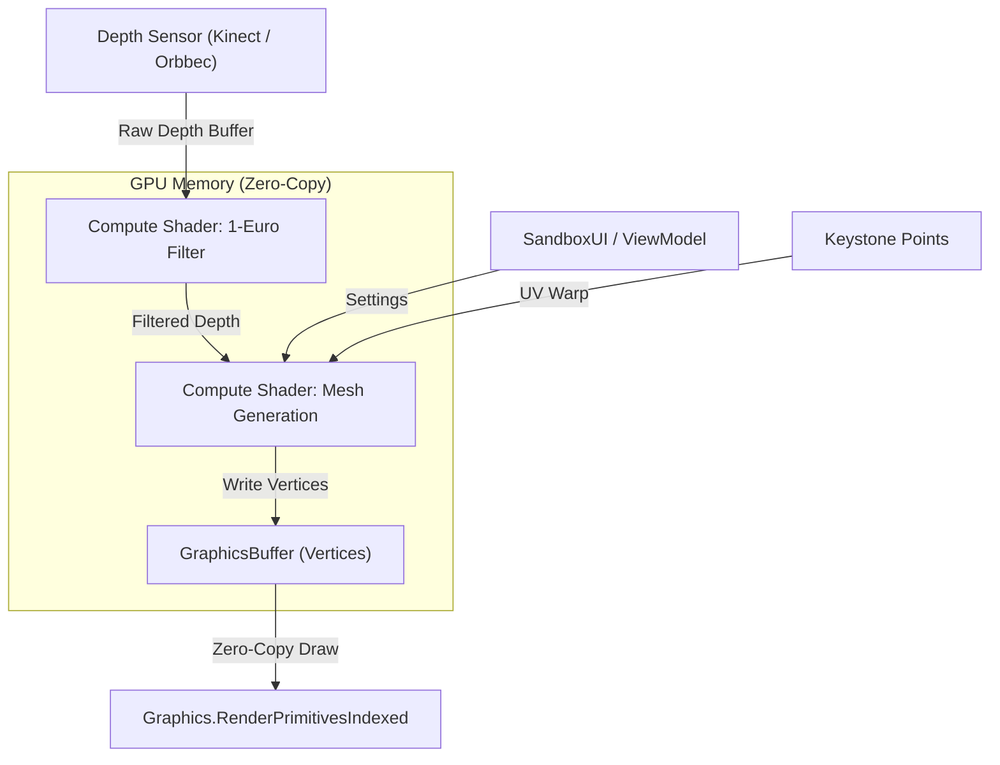

# System Architecture — Deep Dive

This document provides a detailed technical breakdown of the AR Sandbox Kiosk's internal systems.

---

## Zero-Copy GPGPU Pipeline

The entire simulation pipeline runs on the GPU. Data never returns to the CPU during normal operation.



### Pipeline Flow
1. **Input**: Depth frames are uploaded to a `ComputeBuffer`.
2. **Filter**: `TerrainSimulation.compute` applies 1-Euro adaptive de-noising per-pixel.
3. **Generate**: The same shader generates grid vertices directly into a `GraphicsBuffer`.
4. **Render**: `Graphics.RenderPrimitivesIndexed` draws the buffer without CPU readback.

---

## Module Responsibilities

| Module | Role |
|---|---|
| `ARSandboxController` | Orchestrator. Owns the pipeline, manages providers and settings. |
| `DepthProcessor` | Dispatches the FilterDepth compute kernel. |
| `TerrainMeshGenerator` | Dispatches the GenerateMesh kernel and handles procedural rendering. |
| `SandboxUI` | UI View (MVVM). Binds sliders/buttons to ViewModel. |
| `SandboxViewModel` | Data bridge between UI and Settings. |
| `CalibrationSystem` | Handles keystone handle dragging and overlay. |
| `CameraSystem` | Manages camera view cycling and zoom. |

---

## Keystone Calibration

The projector and depth sensor are physically offset. To align them, 4 calibration points (`_pBL`, `_pTL`, `_pTR`, `_pBR`) define the sensor's view of the sandbox corners.

For each mesh vertex at UV `(u, v)`:

```hlsl
float2 leftEdge  = lerp(_pBL, _pTL, v);
float2 rightEdge = lerp(_pBR, _pTR, v);
float2 sampleUV  = lerp(leftEdge, rightEdge, u);
```

This bilinear interpolation maps the regular grid to the sensor's perspective, correcting for angular offset.

---

## 1-Euro Adaptive Filter

Each pixel maintains its own filter state (previous filtered value + previous raw value). The filter adapts its cutoff frequency based on signal velocity:

- **Still sand**: Low cutoff → heavy smoothing → rock-steady.
- **Moving hand**: High cutoff → light smoothing → responsive tracking.

```
cutoff = MinCutoff + Beta * |velocity|
alpha  = 1 - exp(-deltaTime / tau)
filtered = lerp(previousFiltered, raw, alpha)
```

---

## ROI Boundary Masking

A convex quadrilateral defined by 4 UV points crops the active sandbox area. The `IsPointInQuad()` function uses cross-product winding checks to determine if each vertex is inside or outside the boundary. Outside vertices are forced to height 0.

---

## Depth Providers

The system supports multiple depth sources via the `IDepthProvider` interface:

| Provider | Source |
|---|---|
| `FemtoDepthProvider` | Orbbec Femto Bolt (via K4A wrapper) |
| `KinectDepthProvider` | Azure Kinect DK |
| `SimulatedDepthProvider` | Procedural Perlin noise (no hardware needed) |

Auto-detection runs at startup: Femto → Kinect → Simulation fallback.
