# Kiosk Flow Investigation Report

## 1. High-Level Flow Overview

The Kiosk operates on a "GPU-Keep-Alive" architecture where the CPU manages state and settings, while the GPU handles the heavy lifting of depth processing and mesh generation.

### Core Loop (Per Frame)
1.  **Input**: `KinectDepthProvider` (or Simulator) captures a chaos of depth points (16-bit integers).
2.  **GPU Processing**:
    *   **Filtering**: `TerrainSimulation.compute` applies a 1-Euro filter to smooth jitter and fills holes.
    *   **Mesh Generation**: `TerrainSimulation.compute` directly maps the filtered depth buffer to a generic Grid Mesh.
3.  **Rendering**: `Topography.shader` renders this mesh using Triplanar mapping (for sand texture) and a Color Gradient (for height interpretation).
4.  **UI**: `SandboxUI` overlays controls for the user to adjust parameters in real-time.

## 2. User Interaction Flow (The Kiosk Experience)

The Kiosk is designed to be "Always On" but has an Admin/Operator layer.

```mermaid
graph TD
    A[Start Application] --> B{Calibration Needed?};
    B -- Yes --> C[Setup Tab];
    B -- No --> D[View Tab (Operational)];
    
    D --> |User Interaction| E[Sandbox Experience];
    E --> |Touch/Sand| F[Terrain Updates];
    
    subgraph Admin Controls
        G[Toggle UI (Tab/~)] --> H[Admin Panel];
        H --> I[View Tab];
        H --> J[Setup Tab];
        H --> K[World Tab];
        
        I --> |Adjust| L[Visuals (Colors, Water)];
        J --> |Calibrate| M[Floor & ROI];
        K --> |System| N[Mesh Size];
    end
    
    M --> O[ROI Editor / Calibration View];
    O --> |Save| P[Settings (JSON)];
    L --> |Save| P;
```

### Key User Actions

*   **Operational Mode**:
    *   Users interact with the physical sand.
    *   The projector updates immediately (latency < 30ms).
    *   No direct software interaction required for general public.

*   **Setup/Admin Mode** (Accessed via Button/Keyboard):
    *   **View Tab**: Change themes (Desert, Volcano), adjust water level, tweak visual flair.
    *   **Setup Tab**:
        *   **Auto-Calibrate Floor**: Sets the "Zero" plane for the sand.
        *   **Edit Boundary (ROI)**: Launches `ROIEditorView` to mask out the box edges.
        *   **Sensor Stability**: Tweak the 1-Euro filter to balance Lag vs. Jitter.
    *   **World Tab**: Set physical dimensions of the box.

## 3. Data Flow Architecture

The "GPU-Keep-Alive" pipeline ensures that depth data rarely leaves the GPU memory once uploaded, maximizing performance.

```mermaid
sequenceDiagram
    participant Sensor as Kinect/Simulator
    participant CPU as ARSandboxController
    participant CS as ComputeShader (GPU)
    participant Mat as Material/Shader (GPU)

    Sensor->>CPU: Raw Depth Frame (Array)
    CPU->>CS: Upload Raw Buffer
    
    rect rgb(0, 0, 50)
        Note right of CPU: GPU Processing
        CS->>CS: Kernel: FilterDepth (Smooth & Mask)
        CS->>CS: Kernel: GenerateMesh (Displace Vertices)
    end
    
    CPU->>Mat: Update Props (Colors, Water Level)
    Mat->>Mat: Render (Triplanar & Color Ramp)
    Mat-->>User: Visual Output
```



## 4. Key Components Analysis

| Component | Responsibility | Criticality |
| :--- | :--- | :--- |
| **ARSandboxController** | The Conductor. Initializes everything, runs the Update loop, sends data to GPU. | **CRITICAL** |
| **SandboxUI** | The Dashboard. Manages all UI overlay panels, sliders, and buttons. Communicates with Controller via ViewModel. | **HIGH** |
| **TerrainSimulation.compute** | The Engine. Performs the actual math on the GPU. Contains logic for Filtering and Meshing. | **CRITICAL** |
| **SandboxSettingsSO** | The Memory. A ScriptableObject that holds all configuration (Water Level, Colors, Calibration data). Persisted to JSON. | **HIGH** |
| **ROIEditorView** | The Mask Tool. A specialized UI view to draw the polygon mask defining the active sand area. | **MEDIUM** |

## 5. Potential "Flow" Issues observed

*   **Initialization Race**: `SandboxUI` checks for `ViewModel.Settings` and warns about potential null. This suggests the startup order is delicate.
*   **Dual Input Systems**: The code has `#if ENABLE_INPUT_SYSTEM` and `#if ENABLE_LEGACY_INPUT_MANAGER` blocks. Ensuring the correct one is active is crucial for Kiosk inputs.
*   **Hidden UI**: The UI defaults to hidden or requires a keypress (Tab). In a Kiosk with no keyboard, accidental closure could be problematic unless a touch gesture exists (none observed in `SandboxUI.cs` explicitly for *opening*, only hiding on idle).

