# Kiosk vs. AR-Sandbox Sim: Flow Design

## Core Philosophy
The application must strictly distinguish between **Operating Reality** (Kiosk) and **Simulating Reality** (Sim). Mixing these states leads to operator confusion (e.g., trying to calibrate a projector that doesn't exist in Sim mode).

## 1. The Two Worlds

### Mode A: Kiosk (Hardware)
*   **Context**: Physical installation. Projector, Kinect, Sand.
*   **Primary Input**: Depth Sensor (Kinect).
*   **Goal**: Augment physical reality.
*   **Critical Actions**: Alignment, Calibration, Masking.
*   **Risk**: Sensor failure, Projector misalignment.

### Mode B: Simulation (Software)
*   **Context**: Developer laptop, testing without hardware.
*   **Primary Input**: Virtual Noise / Mouse Interaction.
*   **Goal**: Test shaders, fluid physics, and gameplay logic.
*   **Critical Actions**: Adjusting noise parameters, Simulating hand interaction.
*   **Risk**: "Works on my machine" but fails on hardware.

## 2. Interaction Flow

```mermaid
graph TD
    Start[Application Start] --> Init{Hardware Check}
    
    Init -- Sensors Found --> KioskState["KIOSK MODE\n(Hardware Driven)"]
    Init -- No Sensors --> SimState["SIMULATION MODE\n(Software Driven)"]
    
    style KioskState fill:#332b00,stroke:#FFBF00,stroke-width:2px
    style SimState fill:#002b2b,stroke:#008080,stroke-width:2px
    
    subgraph "Kiosk Flow"
    KioskState --> AdminK["Admin Panel (Amber)"]
    AdminK --> Align["Align Projector"]
    AdminK --> Mask["Define ROI"]
    end
    
    subgraph "Sim Flow"
    SimState --> AdminS["Admin Panel (Teal)"]
    AdminS --> Noise["Adjust Chaos"]
    AdminS --> VirtualHand["Simulate Hands (Radius)"]
    end
    
    %% Switching
    AdminK -- "Override Sensor" --> SimState
    AdminS -- "Enable Sensor (3s Limit)" --> Init
```

## 3. UI State Matrix

| Feature | Kiosk Mode (Kiosk) | Simulation Mode (Sim) |
| :--- | :--- | :--- |
| **Theme Color** | Deep Amber (`#FFBF00`) | Muted Teal (`#008080`) |
| **Depth Source** | Azure Kinect (Raw) | 2D Perlin Noise (Generated) |
| **Projector Calibration** | **VISIBLE** | *HIDDEN* |
| **ROI / Masking** | **VISIBLE** | *HIDDEN* |
| **Sim Controls** (Speed/Chaos) | *HIDDEN* | **VISIBLE** |
| **Walls** | Visible (Optional) | Visible (Default) |
| **Hand Injection** | Real Hands (Depth) | **Simulated Circle** (100mm Radius) |

## 4. Transition Logic

### Switching from Kiosk -> Sim
1.  User toggles "Override Sensor" in Admin UI.
2.  **Action**: Kinect Provider stops. Sim Provider starts.
3.  **UI**: Screen fades to Black -> Shows "ENTERING SIMULATION" -> Header turns Teal.

### Switching from Sim -> Kiosk
1.  User toggles "Enable Sensor".
2.  **Action**: System starts a **3-second watchdog timer**.
    *   *If Handshake < 3s*: Header turns Amber. Terrain updates from Kinect.
    *   *If Handshake > 3s*: Timeout! Kill the thread, show "Hardware Timeout", and revert to Sim mode immediately to keep the exhibit running.

## 5. Failure Handling (The Disaster Protocol)
*Refer to [Disaster_Protocol.md](./Disaster_Protocol.md) for frame-by-frame failure flows.*
