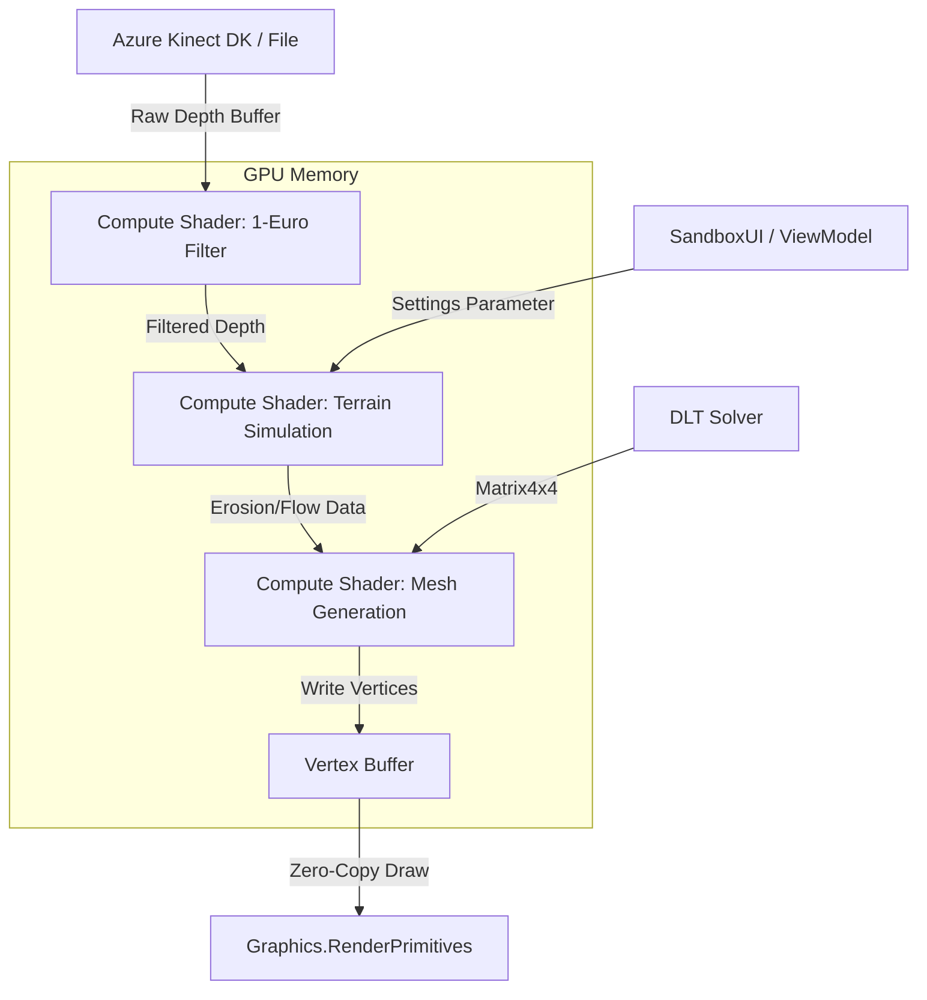

# AR Sandbox Kiosk (Operational Refactor)

A high-performance, studio-grade Augmented Reality (AR) Sandbox built in Unity. This project features advanced de-noising, real-time bicubic topography generation, and an exhibit-centric user interface designed for public installations.

---

## � Project Navigation
To maintain a clean Unity workspace, all project documentation has been moved to the root `/Docs` directory.

- **[Coding Standards](./Docs/Standards/Coding_Standard.md)**: Naming conventions and performance rules.
- **[Implementation Manual](./Docs/Technical/Implementation_Manual.md)**: Deep dive into the architecture and de-noising math.
- **[Deployment Guide](./Docs/Guides/Deployment_Guide.md)**: Instructions for setting up the kiosk hardware.
- **[Bug Fix Log](./Docs/History/Bug_Fix_Log.md)**: Historical record of optimizations and stabilization.

---

## 🚀 Key High-End Features

### 🖥️ GPGPU Simulation (Zero-Copy)
- **Zero-Latency**: Entire simulation pipeline moved to **Compute Shaders**.
- **Performance**: Stable 60FPS at 1024x1024 grid size. No CPU overhead for mesh generation.
- **Rendering**: Uses `Graphics.RenderPrimitives` for direct GPU-to-GPU drawing.

### 📐 Real-World Alignment
- **DLT Calibration**: Scientifically accurate Projector-Camera mapping using **Direct Linear Transform**.
- **ROI Masking**: Define the active sandbox area by clicking 4 corners. Everything outside is automatically cropped.
- **Persistence**: All settings (Calibration, Boundary, Visuals) are auto-saved to JSON.

### 🛡️ 1€ Adaptive Filter (De-noising)
- Core compute logic offloaded to **Unity Burst & Job System** for near-zero latency.
- Dynamic adaptation: Rock-steady stability when still (**Anti-Shake**) and high-speed responsiveness when moving (**Follow Speed**).

### ️ Precision Topography
- **16-Tap Bicubic Filtering**: Custom sampling kernel eliminates "stair-stepping" artifacts.
- **Absolute Color Mapping**: Professional elevation palettes (UC Davis, Desert, Topographic).
- **Pixel-Perfect Contours**: Screen-space stable lines.

### ✋ Exhibit-Grade UX
- **Hand Rejection**: Intelligent height-velocity filtering protects the topography.
- **Auto-Hide Admin UI**: Fades during inactivity.
- **Atmospheric Presets**: Instant environment shifts.

---

## 🛠️ Technical Overview
- **Hardware**: Compatible with Azure Kinect, Kinect v2, and Simulated data.
- **Architecture**: Decoupled MVVM Pattern (`SandboxUI` <-> `ViewModel` <-> `Orchestrator`).
- **Persistence**: `SandboxSettingsManager` handles robust JSON serialization.
- **Standards**: 100% compliant with the `PascalCase` (Public) and `_camelCase` (Private) naming standards.

---

## 🏗️ System Architecture

This project uses a **Zero-Copy GPGPU Pipeline** to maximize performance. Data stays on the GPU as much as possible.

### **Pipeline Flow**
1.  **Input**: Depth frames are uploaded to a `ComputeBuffer` (Data).
2.  **Process**: The `TerrainSimulation.compute` shader applies de-noising and masking logic.
3.  **Generate**: The shader generates the grid vertices directly into a `GraphicsBuffer`.
4.  **Render**: Unity's `Graphics.RenderPrimitives` draws this buffer without ever reading it back to the CPU.

---

## 🕹️ Controls & Setup

### **Getting Started**
1. Ensure your Kinect sensor is connected.
2. Run `UpdateAndRun.bat` or open the project in Unity.
3. Open the **ADMIN** panel (`Tab`).
4. **Define Boundary**: Go to **SETUP** -> **Edit Boundary (ROI)** and click the 4 corners of your sandbox.
5. **Calibrate Floor**: Go to **SETUP** -> **Auto-Calibrate Floor** to zero the height.

### **Key Bindings**
- **Toggle UI**: `Tab` or `` ` `` (Tilde)
- **Cycle Monitor View**: `Left/Right Arrows` (Top, Perspective, Side)
- **Camera Zoom**: `Up/Down Arrows`
- **Reload Scene**: `R`
- **Exit application**: `Esc`

---
**Maintained by**: Ralph Workspace Workflow 🚀
